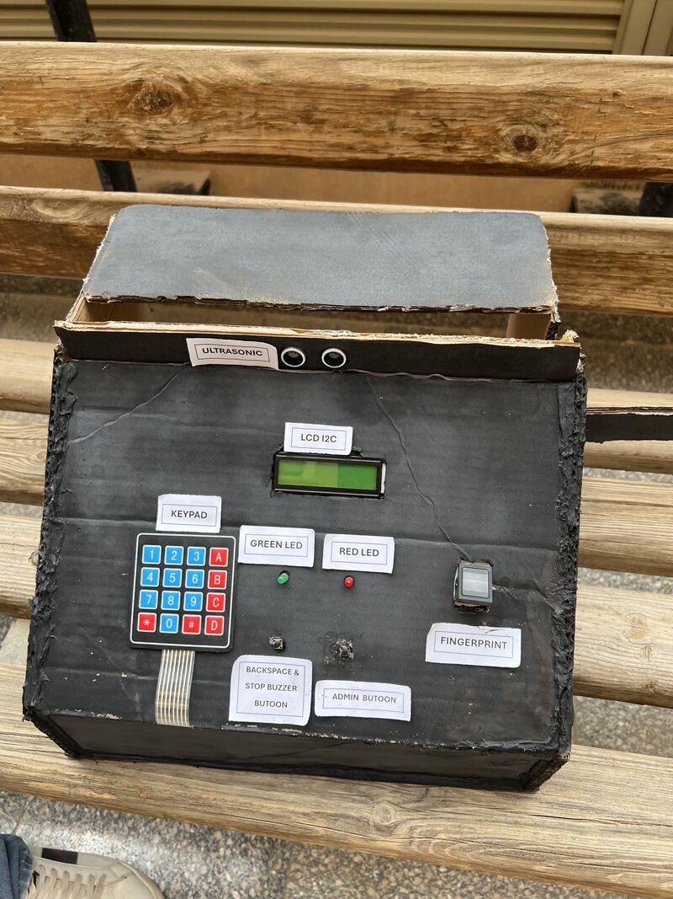
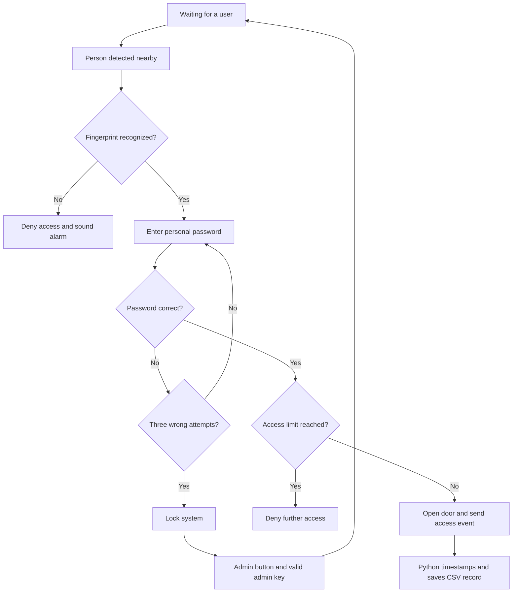
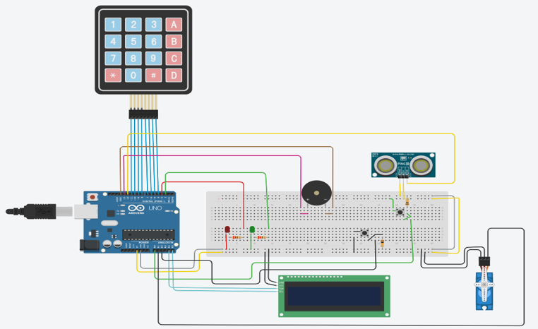

# Smart Attendance & Access Control System

**An Arduino-based embedded project combining fingerprint authentication, password verification, automatic door control, and Python attendance logging.**

The system detects a nearby user, verifies their fingerprint and personal password, and opens a servo-controlled door after successful authentication. A connected Python application receives access events over serial communication and saves timestamped attendance records to a CSV file.



[Watch the demo](Images/Demo%20Video.mp4) · [Read the project report](Embeded%20System%20Report.docx) · [View attendance records](Data/attendance.csv)

## Overview

Developed as an embedded systems project, this prototype explores automated attendance and controlled access for settings such as university laboratories, offices, and restricted rooms. It brings together sensor interfacing, biometric identification, keypad input, actuator control, and host-side data logging.

## Features

- **Presence detection:** An ultrasonic sensor starts the authentication session when a person is within the reported 20 cm threshold.
- **Two-step authentication:** A recognized fingerprint must be followed by the corresponding four-digit password.
- **Automatic door control:** A servo opens the door after successful authentication and closes it after a short delay.
- **User feedback:** An I2C LCD displays instructions and status messages; LEDs and a buzzer indicate success, rejection, and lock conditions.
- **Security lock:** Three incorrect password attempts trigger a lock state with a red LED and continuous buzzer alarm.
- **Administrator recovery:** An admin button and administrator key allow the system to be unlocked.
- **Attendance and leave tracking:** The first successful access records attendance, the second records leave, and further accesses are denied according to the access counter.
- **CSV logging:** Python adds the host computer's date and time to serial events and stores the resulting records.

## Authentication Flow



This diagram summarizes the behavior described in the project report. The Arduino sketch defines the detailed timing, session-reset behavior, and counter handling.

## Hardware

| Component | Role |
| --- | --- |
| Arduino Uno | Main controller and authentication logic |
| Fingerprint sensor | Matches users against enrolled fingerprints |
| Ultrasonic sensor | Detects a nearby person |
| Keypad | Accepts user passwords and administrator input |
| PCF8574 I/O expander | Connects the keypad through I2C |
| I2C LCD | Displays prompts and system messages |
| Servo motor | Demonstrates door opening and closing |
| LEDs | Indicate access and security status |
| Buzzer | Provides audible alerts |
| Push buttons | Reset and administrator controls |

### Circuit



Use the circuit image together with the pin definitions in the Arduino sketch when assembling the hardware.

## Software Architecture

| Layer | Responsibilities |
| --- | --- |
| Inputs | Fingerprint capture, keypad scanning, distance measurement, and button input |
| Processing | User identification, password checks, access counters, and lock-state handling |
| Outputs | LCD messages, servo movement, LED status, and buzzer alerts |
| Communication | Arduino-to-Python serial access events |
| Storage | Timestamped attendance and leave records in CSV format |

### Arduino Libraries

The report lists the following headers:

| Header | Purpose |
| --- | --- |
| `Wire.h` | I2C communication |
| `LiquidCrystal_I2C.h` | LCD control |
| `Servo.h` | Servo motor control |
| `EEPROM.h` | EEPROM memory access |
| `PCF8574.h` | I/O expander access for keypad scanning |
| `SoftwareSerial.h` | Software serial communication |
| `Adafruit_Fingerprint.h` | Fingerprint sensor communication and matching |

Library versions and exact hardware pin assignments are not specified in the report. Select dependencies compatible with the APIs used in the sketch. The presence of `EEPROM.h` does not establish that attendance counters persist across restarts; persistent counters are listed as future work.

## Repository Contents

| Path | Contents |
| --- | --- |
| `Arduino/attendance_system/attendance_system.ino` | Arduino firmware |
| `Python/attendance.py` | Python attendance application |
| `Python/whatsapp.py` | Additional WhatsApp-related script; its setup and invocation are not detailed in the report |
| `Data/attendance.csv` | Included attendance records |
| `Images/` | Hardware photographs, circuit image, output screenshots, and demo video |
| `Embeded System Report.docx` | Full project report |

## Setup and Operation

### 1. Prepare the Hardware and Firmware

1. Assemble the components using the circuit image and sketch pin assignments.
2. Open `Arduino/attendance_system/attendance_system.ino` in the Arduino IDE.
3. Install the external libraries required by the sketch and select the Arduino Uno board and its serial port.
4. Enroll the intended users' fingerprints using the procedure supported by the sensor, then ensure fingerprint IDs match the user mappings in the sketch.
5. Review the configured user names, passwords, administrator key, I2C addresses, and servo settings.
6. Upload the sketch to the board.

The report describes a closed servo position of **0°** and an open position of **90°**. Confirm those positions suit the physical assembly before operation.

### 2. Prepare the Python Application

Install Python, then inspect `Python/attendance.py` and `Python/whatsapp.py` for their imported dependencies and configuration. Set the serial port to the connected Arduino and match the baud rate used by the firmware. Confirm the CSV output path before starting the logger.

From the repository root in Windows CMD, run the attendance application:

```cmd
python Python\attendance.py
```

If the application uses paths relative to its working directory, adjust its configuration or launch directory accordingly. The report does not specify the exact Python dependencies, COM port, baud rate, or WhatsApp integration requirements.

### 3. Use the System

1. Start the Python logger with the Arduino connected.
2. Stand near the ultrasonic sensor.
3. Place an enrolled finger on the fingerprint sensor.
4. Enter the corresponding four-digit password when prompted.
5. Observe the door movement and LCD feedback, then check the CSV output.
6. Use the administrator recovery procedure if the system enters lock mode.

## Attendance Data

The report describes serial events containing three comma-separated values:

```text
ID,Name,Status
```

Python appends the current date and time to produce records with these fields:

| Field | Meaning |
| --- | --- |
| `ID` | User identifier |
| `Name` | User name |
| `Date` | Date recorded by the host computer |
| `Time` | Time recorded by the host computer |
| `Status` | Attendance or leave event |

The access rule is based on a per-user counter. A daily reset schedule and persistence across power cycles are not established in the report.


## Reported Testing

The project report records the following outcomes. These are reported project results, not an automated test suite or an independent verification of the repository.

| Scenario | Reported outcome |
| --- | --- |
| Recognized fingerprint and correct password | Door opened and attendance was saved |
| Unrecognized fingerprint | Access denied and alarm activated |
| Three wrong password attempts | System entered lock mode |
| Correct administrator key during recovery | System unlocked and alarm stopped |
| CSV logging | Attendance records were saved with timestamps |

## Future Improvements

- Online database and cloud storage integration.
- Wi-Fi or Bluetooth connectivity.
- Mobile application and real-time monitoring dashboard.
- Face recognition using an AI camera.
- Support for more users.
- Encryption of attendance records.
- Persistent access counters using EEPROM.
- Battery backup for power interruptions.

## Documentation Scope

This README is based on the supplied project report and repository file inventory. Exact dependency versions, wiring details, configuration values, and script behavior should be checked against the source code before reproducing the setup. The project is documented as an educational prototype; the report does not establish production security guarantees.
